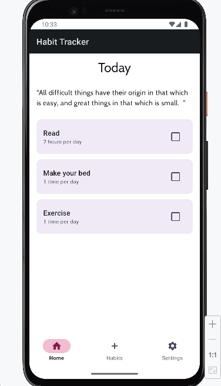
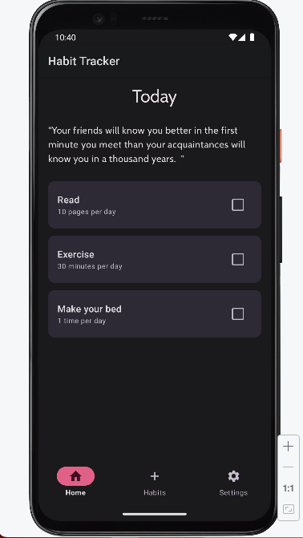
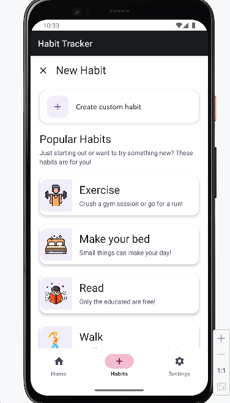
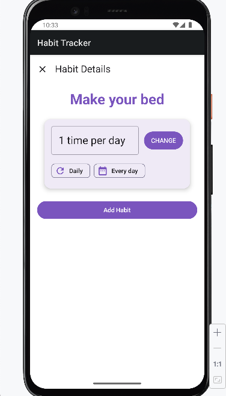
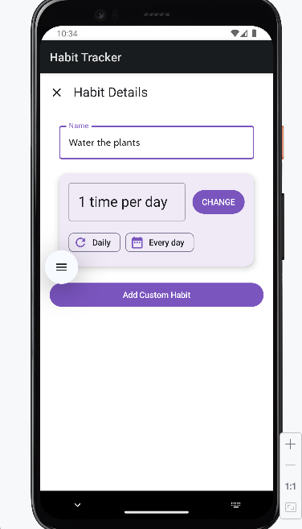

# Habit Tracker

Habit Tracker is a simple and modern Android app built with Jetpack Compose. 
It helps users build better habits by allowing them to create, edit, and track daily habits, all in a clean and intuitive interface.

## Features

- Track your habits: add, edit, and delete habits. Mark them as completed each day.
- Daily inspiration: get a new inspirational quote every day from the [Forismatic API](http://api.forismatic.com/).
- Dark & light mode: easily switch between light and dark themes from the settings screen.
- Organized navigation: bottom navigation bar with Home, Habits, and Settings screens.
- Modern architecture: built with MVVM, Room Database, and best practices for Android development.
- Smooth experience: uses Kotlin coroutines for fast and responsive UI.

## Tech Stack

- Kotlin
- Jetpack Compose
- Room Database
- Retrofit (Forismatic API integration)
- MVVM Architecture
- Coroutines

## Screenshots


*Shows the main dashboard with today\'s habits and progress in light mode.*


*Presents the main dashboard and habits list in dark mode for comfortable night-time use.*


*Displays the list of all habits, with options to add, edit, or delete habits in light mode.*





## Getting Started

1. Clone the repository:
   ```sh
   git clone https://github.com/SilviaDragan/HabitTracker